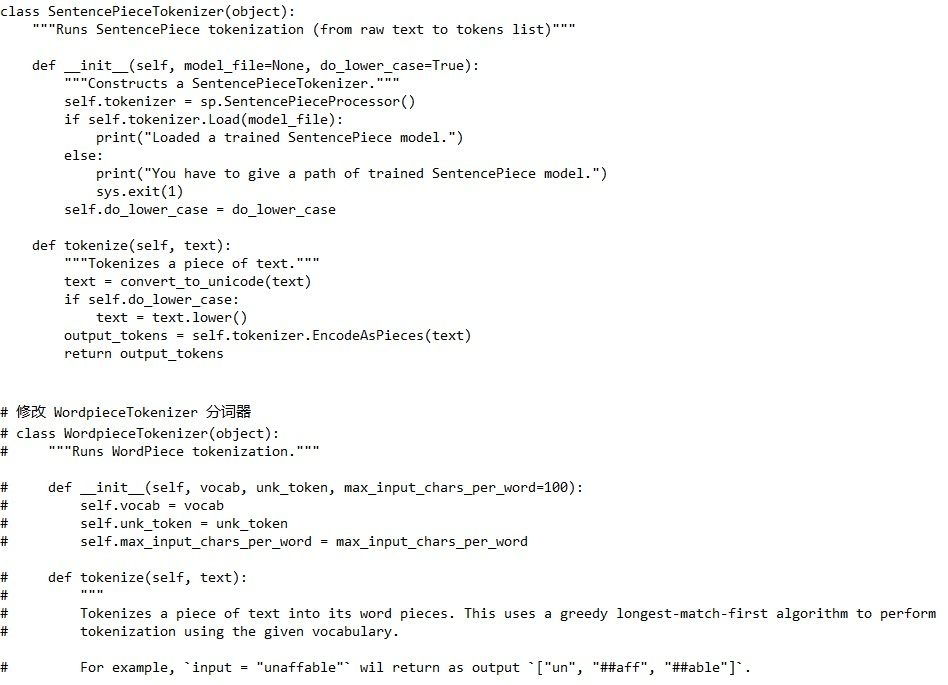
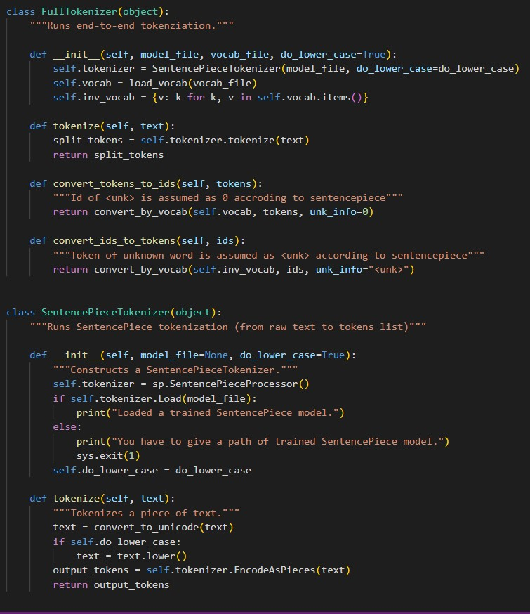

# TBERT、Tibetan-BERT-wwm

近年来在自然语言处理领域，预训练语言模型（Pre-trained Language Model, PLM）已迅速崭露头角，成为当之无愧的重要基础技术。

藏文，作为世界上的一种重要语言，具有悠久的历史和深厚的文化底蕴。然而，由于其数据资源受限和技术挑战性，藏语自然语言处理技术发展相对滞后。通过几代人不断的努力，现在开始在各个领域开展深度研究，取得了令人瞩目的成绩。近年来，预训练语言模型也被提上议事日程，多方进行研究。

为了进一步推动藏文信息处理领域的发展，青海师范大学省部共建藏语智能信息处理及应用国家重点实验室多拉教授团队和兰州大学开源软件与实时系统教育部工程研究中心共同发布了藏文预训练语言模型 TBERT 和 Tibetan-BERT-wwm。希望这两个预训练模型能为藏语自然语言处理研究者和开发者带来帮助，以期共同推进藏文信息技术的发展。 

# 模型

2023/10/8 我们发布了藏文预训练语言模型 TBERT，欢迎试用。

2023/10/8 我们发布了藏文全词掩码预训练语言模型 Tibetan-BERT-wwm，欢迎试用。

# 模型下载

目前提供 PyTorch 版本和 Tensorflow 版本的 TBERT 模型的下载。Tensorflow 版本 Tibetan-BERT-wwm 模型的下载。

| 模型名称     | 模型下载地址                        |
|----------------|------------------------------------------------|
| TBERT-pytorch | https://huggingface.co/Pagewood/TBERT-pytorch       |
| TBERT-tensorflow | https://huggingface.co/Pagewood/TBERT-tensorflow |
| Tibetan-BERT-wwm | https://huggingface.co/Pagewood/Tibetan-BERT-wwm |


# 模型使用

## TBERT 模型使用

注：TBERT 使用SentencePiece构建词表，需将Google发布的[BERT](https://github.com/google-research/bert)中的 WordPiece 分词器替换为可以加载 SentencePiece 的分词器，在使用时TBERT需注意。

PyTorch 版本（可以直接使用 Transformers 中的 BertModel 进行加载）

```python
模型加载
    from transformers import BertModel,BertTokenizer
    BERT_PATH = ''
    tokenizer = BertTokenizer.from_pretrained(BERT_PATH)
    bert = BertModel.from_pretrained(BERT_PATH)
```
 [transformers](https://github.com/huggingface/transformers)工具库源码修改
	路径：src/transformers/models/bert/tokenization_bert.py

- 将 WordPiece 分词器替换为SentencePiece



- 修改src/transformers/models/bert/tokenization_bert.py中的VOCAB_FILES_NAMES 与 MODEL_FILE_PATH变量。

tensorflow 版本(以[谷歌源码](https://github.com/google-research/bert)为例)

```
谷歌源码中tokenization.py分词器修改
将 class WordpieceTokenizer(object)、class BasicTokenizer(object) 替换为class SentencePieceTokenizer(object)
```



## Tibetan-BERT-wwm 模型使用

Tibetan-BERT-wwm 结构与 BERT 相同。

Tensorflow 版本使用方法同[BERT](https://github.com/google-research/bert)

# 训练数据

- TBERT：6.27 GB
- Tibetan-BERT-wwm：4.63 GB

# 致谢

感谢所有参与此项目的团队和个人，以及为模型训练提供数据和资源的组织。
